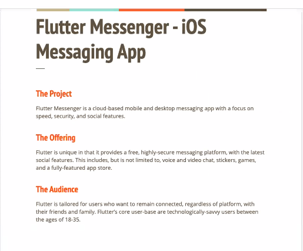
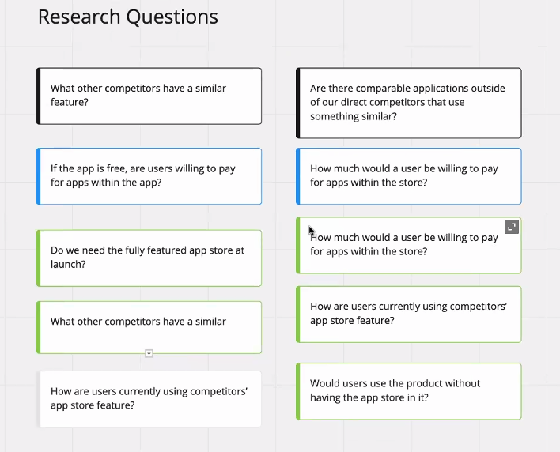
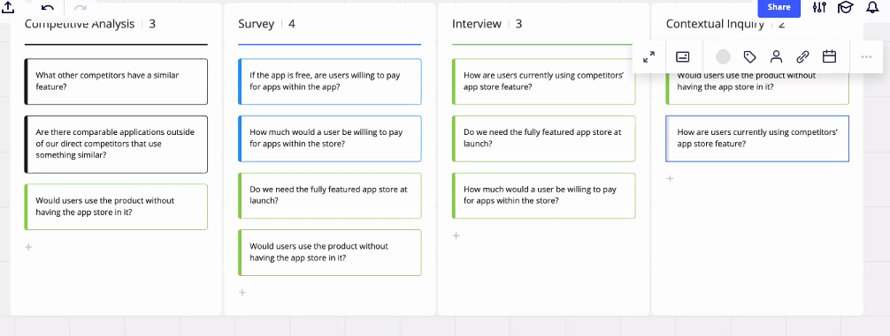
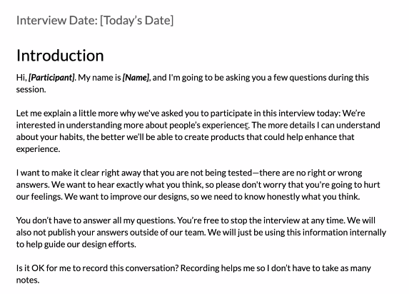

# Research Planning

Table of Contents:  

a. [Additional Resources](#Additional-Resources)  <br>  
b. [Types of Research](#Types-of-Research)  <br>  
c. [Assumptions](#Assumptions)  <br>  
d. [Asking Questions](#Asking-Questions)  <br>  
e. [Student Toolkit Information](#Student-Toolkit-Information)  <br>  

<br>


## Additional Resources

#### Pre-Class Videos

[Recruiting (4 min)](https://youtu.be/xq8xL2GgdWk)  
[Research Methods (10 min)](https://youtu.be/F3VhdgHUsmQ)  


#### Assignment

[Research Planning UX8 - Glenn Ference](https://youtu.be/38N-MLpaWlw) 
[Research Planning UXPT3 - Corey Nelson]()   

[Research Planning Assignment](https://docs.google.com/document/d/1X4x7Y3NJaukchTuj0dqV7I6iBDTuxxKvKJtl-NxM6CM/edit)  

#### Other Cool Links

[Milanote](https://milanote.com), an in-browser app to organize research and project flow.

[Miro](http://miro.com), a team collaboration browser software to help create project flows with Kanban boards, notes, and diagrams.

[Research Interview Guide Template](https://docs.google.com/document/d/1GzNaxRPZBrhnb6TWgz0LS1xq9UbL7a5ffqCZ09Xrb0g/edit?usp=sharing), to help outline how to conduct an interview well.

<br>

## Types of Research

### Survey

One of the best quantitatve research methods are surveys, which are used to receive user feedback from large groups of people that can shape the direction of the project.

It helps clarify the user base with statistical analysis.

<br>

### Contextual Inquiry

This is when we observe the user in their natural, day-to-day environment to understand how they engage with the product or service. This helps understand how the application with fit into their life without being interruptive.

It's useful for developing empathy for the user and seeing the full context of their behavior (as opposed to in a lab).

<br>

### Focus Group

A small curated group whose reactions are studied to predict the opinions of the larger public.

Group Think is a possible issue to be aware of where the opinion of the group is influenced by a particularly vocal member. They may also just tell you what they think you want to hear, rather than their own opinion.

<br>

### Usability Testing

In an interview setting, watching a user use the product/service, looking for any issues with their ability to succesfully navigate it.

Because it's in a controlled setting, it can't fully mimic how a user would implement this within their daily life.

<br>

### Analytics

Analytics provides a lot of tactical data -- it's not based on opinions or feelings. Instead, it shows where the user clicked or when they exited, etc. It shows their actual behavior within the application (without their reaction). It's data driven.

<br>

### Competitive Analysis

Taking a look at what the company's competitors are doing to see what they might be doing better or seek to understand why they chose an alternate approach.

It can shows gaps where your product/service could excel with better implementation, or it might reveal paradigms that well established companies have setup users to expect.

<br>
<br>

## Assumptions

Let's look at this brief:



We're going to make some assumptions based on the brief about what the client is looking for (like, "Fully featured app store", "focus on speed").

Other things that stand out:

> Ages 18-35  
> Secure  
> Voice and video chat  
> Stickers  
> Games  
> Fully-featured app store  
> Cutting edge technology  
> Needs to be generalized enough to expand in the future  
> Function regardless of platform (across devices and operating systems)  

<br>

Another way to approach this would be to answer these questions when thinking about the brief:

```
I believe my users have a need to____________.
I believe these needs can be solved with____________.
I believe the #1 value a user wants to get out of this is____________.
I believe the user can also get these additional benefits____________.
I believe my biggest product risk is____________.
```

<br>

We can then map our assumptions onto a map that looks like so, asking where on these charts each one falls based on the *User's perspective*:

```

                High Risk
                    |
                    |
                    |
                    |
Known ---------------------------- Unknown
                    |
                    |
                    |
                    |
                Low Risk
```

Building out a fully featured app store would fall into the `High Risk` and `Unknown` quadrant, because we don't yet _know_ if the users need that feature, while we do know that it would take immense time and resources for the output.

<br>

A fast messaging app falls under `Known` because existing apps are not slow so the industry standard and user expectation will be for a fast messaging app. It might also be `Low Risk` because it's being commonly done, so it should be possible to execute.

<br>

A highly secure messaging platform is in the middle of `Known` and `Unknown` because it may mean different things to different users based on demographics. What is "secure"? Is it their top priority? That might need research. For determining risk level, how much time will it take to implement? Do we need to worry about it?

We ultimately would place this pretty much in the center because there is a lot of user perspective driving this as a positive feature, but also a lot of unknowns that need to be established through research.

<br>

`Our users will want to use this app with friends` is `Low Risk` and `Known` because the brief is about a social messaging app.

<br>

An important aspect to keep in mind when evaluating features is having a diverse group perspective to provide input that challenge our personal biases and highlight need to accessibility.

The team, at this point, won't have information about the engineering team (most likely), budget or total timeline for the project, so it's difficult to make fully accurate guesses. This is a jumping off point to help brainstorm, that can be pivoted upon later with research and engineering input.

<br>

## Asking Questions

Our next step is to start with the `High Risk` and `Unknown` features and turn each one into a hypothsis that we can research and answer.

For example, with our fully featured app store feature, the client might expand upon it by providing their reasoning:

```
Having a fully featured app store within our messaging app Flutter will increase revenue by charging users for enhanced functionality and by increasing continued engagement by improving application functionality.
```

We need to ask questions that might validate whether or not their perspective is true for their user base?



<br>

This list shows how we might need to do competitive analysis, via a user survey, etc..

The black questions would be ideally dealt with via competitive analysis.

The blue questions would be best asked via a survey.

The green questions could be asked via an interview.

The _how are the users using_  or _would the users use the product if_, could be asked with a contextual inquiry. We want to see their behavior.


<br>

Our answers can be found through several different types of research studies too.

Ideally we would then place these questions under columns in a Kanban board (or similar), duplicating questions that would fit several research options.



<br>

When conducting user research, you need to guide the interview to a place where you're getting honest answers and making the user comfortable, but without supplying answers or bias.

[This research interview guide template](https://docs.google.com/document/d/1GzNaxRPZBrhnb6TWgz0LS1xq9UbL7a5ffqCZ09Xrb0g/edit?usp=sharing) is a great script to base your interactions with user off of during testing:



<br>

Make sure to always get permission before recording a user.

If they ask if you created this project, you can give a true but vague answer like, "I'm part of the design team," to avoid them feeling hesitant to give real feedback.

<br>

[Today's project](https://docs.google.com/document/d/1X4x7Y3NJaukchTuj0dqV7I6iBDTuxxKvKJtl-NxM6CM/edit) will be practicing evaluating assumptions and determining research methods to the Newsies News product brief. 

<br>
<br>

## Student Toolkit Information

<br>

## Determining What to Research

Making a research plan requires critical thinking skills and a sense of the product you’re intending to create or the market you intend to serve. 

From there you can begin to follow a relatively simple process that will help you identify things you need to know more about and things about which you know enough.

<br>

### Assumptions Exercise

You can quickly surface most assumptions about a product by having a quick discussion about the product plan using a list of statements for stakeholders to complete:

<br>

#### User Assumptions

> Who is the user?  
> Where does our product fit in their work or life?  
> What problems does our product solve?  
> When and how is our product used?  
> What features are important?  
> How should our product look and behave?  

<br>

#### Business Assumptions

> I believe that my users/customers have a need to …  
> This need can be solved with …  
> My initial customers will be …  
> The #1 value a customer wants to get out of my service is …  
> The customer can also get these additional benefits …  
> I will acquire the majority of my users/customers through …  
> I will make money by …  
> My primary competition will be …  
> We will beat them in the market due to …  
> My biggest product risk is …  
> We will solve this through …

<br>


Not all questions need to be answered. 

For example, if the product you are designing does not have direct measurable profitability, you can determine a different metric as the basis of your assumption and how that metric impacts the growth or strength of the business.

Take the time to evaluate each assumption. Separate out those assumptions that could have negative consequences for the company if they are wrong. 

Use a Known-Unknown, High-risk-Low-risk scale to find the most critical assumptions. Rank the most critical assumptions on a scale of urgency. Ask: What assumptions does my business hold, that if proven wrong, could cause the business to fail?

This list of assumptions can form the basis of your discovery research efforts at the beginning of your design cycle. Create testable hypotheses for each assumption.

<br>

### Hypotheses to Research Questions

Work from the top of the list of hypotheses as quickly as you can to plan for research that can help validate or invalidate your assumption. 

One way to do this is to create a list of more specific questions based on your hypotheses that could be answered with research. 

Not all the questions will be able to be answered with the same type of research method, so you can then organize your research plan by aligning each question in the list with the type of research that will most effectively answer the question.

<br>

Questions that can more effectively be answered with an in-person interview should be refined further. Most general research questions are not effective as interview questions. 

One usually would need to ask more deep and probing questions. Those questions become part of an interview guide that helps you remember more effectively the questions that will help you validate or invalidate your hypotheses.


Learn to learn how to recruit research interview participants and understand what to look for when choosing between ‘best’ and ‘next-best’ research participants

<br>
<br>

## Recruiting

Your research data will only be as good as the sources it comes from. If you get someone who is not a part of the intended audience, your data will be suspect.

Research projects often have specific needs that require a refined sub-audience from the product audience. It’s important for UX researchers, when recruiting, to ensure they get people who will provide the best data to inform the product designs.

### Research Profile

Before recruiting it is helpful to create a research profile to guide the recruiting process. 

Typically, you will have a general sense of your target audience. Sometimes you will have gathered data to help support the creation of a persona. Sometimes the marketing department will already have a target audience they create marketing campaigns for. 

You can reference this information in order to have a foundation for your research profile.

<br>

You might start with demographic information—census data, essentially: age, gender, education, income.

Next would be a technology and web-use or application-use profile helping give definition to the type of experience your audience has with the technology of your product.

Then ask yourself what specifically you need in your audience that is different from the target market per se. Find factors that can help you hone in on an ideal research audience.

> Which market segments are most affected by the research?  
> Is there a single group or multiple groups?  
> Which factors most affect this research?  
> What are desirable characteristics? What are undesirable?  


Don’t make your research audience profile so narrow that you can’t find anyone that fits. Sometimes you’ll have multiple audiences you need to research for, so create separate profiles for each.

<br>

### Commercial Recruiters

Commercial recruiters have their own database of thousands of people from a variety of circumstances and matching a wide set of different demographics.

They can perform queries on their databases to find individuals who map to your requirements.

Recruiters will help you build what is called a screener. The screener is a set of questions that helps the recruiter find the type of person you’re looking for.

<br>

### Creating a Research Database

A good practice for ongoing research is to set up your own database for recruiting purposes.

Set up an email address specific to recruiting—something like `research@example.com`.
Start with the social networks of your company employees.

Build a database of participants by sending out a message through the network asking for people to submit their information.

> Potential sources of participants  
> Corporate neighbors  
> Social groups, mailing lists  
> Users  
> New employees  
> Past research participants  
> Ads  
> Incentives  

<br>

You usually try to provide an incentive of some sort to help persuade people to participate in research.

<br>

### Best vs. Second-Best Recruiting

While the ideal user is your primary target for research, sometimes you have to take second best. When you have the option, you should always opt to find your target audience, you can still get useful and actionable feedback from a second-best user. This can be a colleague, family member or friend.

There’s an adage that goes something like this: Some data is better than no data. While that can be very true, another adage is important to consider: Wrong data is as bad as — or maybe worse than — no data. 

Whenever conducting research, weigh the risks of using a non-representative user as the source for your user research. If the risks are low, the benefits will usually be high. 

Just remember that when the risks are high, caution should be used before consulting a non-target user for feedback on or reaction to a product’s design.

<br>
<br>

## Research Methods

There are a few discovery methods that are useful in UX design for gathering the types of information you need to move forward with design. Understanding these methods can help you more effectively gather data that will inform quality design decisions. Here we introduce a few methods to be considered.

<br>

### Surveys
Surveys are useful to help you understand how your user base might be segmented. They give you a chance to model your audience statistically and make generalizations about how your user base compares to the population as a whole. 

Surveys allow you gather details about your user base that will help inform your decisions about who to recruit for qualitative research.

Surveys are sets of questions that allow you to get information from a large number of people in a structured and useful way. They can ask people about themselves, their interests, and preferences.

The results of surveys can be evaluated with statistical tools. That is, with a large enough number of people, you can begin to extrapolate the findings of your survey to the broader population, with mathematical certainty. 

You can know just how likely you are to be making a mistake if you base your design decisions on data collected from a survey with a large enough sample size.

<br>

As a rule of thumb, you want to aim for around 350 participants. You might need less if you have a smaller population you want to represent, but having 350 will generally give you enough to extrapolate data to a larger audience. 

You should generally plan on a survey project taking 4-6 weeks to account for question writing and survey set-up, fielding the survey, and analysis.

<br>

### Contextual Inquiry

Contextual inquiry helps you understand people and their behavior regarding your problem space. Observing people in their natural environment helps the researcher study the scenarios their product is meant to assist with to learn more about the users’ mental model associated with the problem at hand.

Contextual inquiry is a process of observing and studying a few individuals in depth to more fully understand the work practice or life practice of the group of people the individuals represent. It is a great, though labor intensive, way to uncover the problems behind the problems.

As Mike Kuniavsky wrote in _Observing the User Experience_:

>> The obvious problem isn’t always the real problem. The person who wants a new hammer and smaller nails? Maybe she really just needs a cheap birdhouse, so she’s making one. Once she’s done, maybe she’ll never need the hammer and nails again.  

<br>

Observing people directly often helps you discover those real, underlying problems that need a solution rather than the obvious, superficial problem.

A contextual inquiry study can take around four weeks to plan and complete.

<br>

### Focus Groups

Focus groups can help gauge peoples’ priorities and emotional connections to problems or concepts. They can help gauge responses to possible solutions and help raise additional concerns to the surface.

Focus groups are generally a structured interview of around eight to 10 people. Focus groups are often conducted in multiple sessions, so you have two to three separate group interviews with a new set of participants in each interview. 

Focus groups can often require additional planning and recruiting to gather all the necessary participants. 

Group interviews also have to be carefully moderated to avoid the “group think” that is often a hallmark of poorly conducted focus groups. 

Using focus groups in combination with other research will provide a richer understanding of your user base and their desires, values, motivations and experiences.

<br>

You can use focus groups to:

> Explore the nature of human experience in a specific domain  
> Prioritize features intended for use by the represented audience  
> Analyze competitors’ products by interviewing their users  
> Investigate trends to understand the underlying behaviors more closely  

Focus groups take approximately three weeks to plan, execute, and analyze.

<br>

### Usability Testing

Usability testing can be used in user research to discover interaction problems. They can be used for competitive benchmarking and or a quick way to evaluate solutions in progress.

Usability testing is generally a fast way to avoid launching product that has “showstopping usability problems.” You conduct them by interviewing individual users while watching them use your product, ideally in performing specified tasks. 

Usability tests can be performed at any stage in the product design cycle at any stage of fidelity. They don’t need to be reserved for the end of a cycle after development has been completed.


You also don’t need to perform very many to be useful. 

Around five interviews with representatives of a specific user type is generally enough to find a sufficient number of usability problems for a particular phase in the design process. But, conducting a single usability study of only 5 participants is not going to find all usability problems and is not going to be sufficient for making ongoing improvements to a particular product or feature. 

A 5-7 participant usability study can generally be planned, conducted, and analyzed within two to three weeks.

<br>

### Analytics

Analytics can be reviewed to learn actual behavior on a site or app, which can uncover pain points and user inclinations, pointing to areas for further research or investigation.

Site or app analytics can be a great resource of understanding actual user behavior. Most companies now use an analytics platform like Google Analytics or Adobe’s Marketing Cloud to track user activity. 

By gaining access to the analytics product, UX researchers can track things like the number of visitors to a specific page, number of clicks or taps on a specific interaction element, time on a page, or even progress through a purchase funnel.


This data can be very informative of trends, but are not explanatory. Analytics tracking can be coupled with other research methods to make testable hypotheses for additional research. 

Analytics can be an ongoing process of review. Exploratory analysis can take much longer than discovering the results of a very targeted query.

<br>
<br>