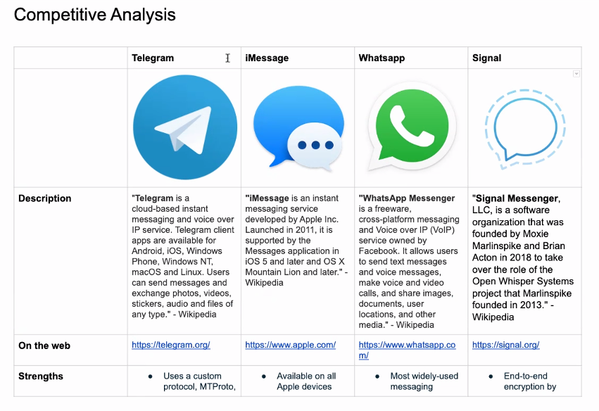
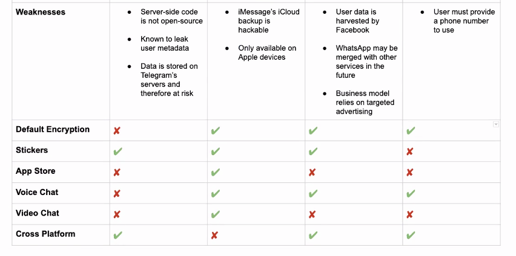

# Secondary Research

Table of Contents:  

a. [Additional Resources](#Additional-Resources)     
b.      
c.      
d.      
e.      
f.      
g.      
h.      
i.        

 

## Additional Resources

#### Pre-Class Videos

[Surveys (5 min)](https://youtu.be/CdP8OiE2Uu0)  
[Competitive Research (5 min)](https://youtu.be/4emNlWOAtBc)  

#### Assignment

[Secondary Research UX8 - Glenn Ference](https://www.youtube.com/watch?v=mTHtp3fbmDo&feature=youtu.be)  
[Secondary Research UXPT3 - Corey Nelson]()  

[Secondary Research Assignment](https://docs.google.com/document/d/1I4cvBlDO712EAfFgawquiTvEV5KSboauCBQdN3tJp7s/edit)  

#### Other Cool Links

 

## Creating a Survey

First, and perhaps most important, you must decide what you want to accomplish with your survey. Here’s an example taken from _“Observing the User Experience: A Practitioner’s Guide to User Research”_:

 

>> “For example, say that you have a mature product, a website that’s been around for several years. Although revenue is decent, the growth of new users has slowed. You have an idea of the size of your audience—but you’re assuming that the kinds of people using your site now are the same as when the site launched. Further, although your site has some unique features, several competitors have similar feature sets. You’ve been counting on your unique features to drive user growth. Though the log files show that the features get used, it’s difficult to tell whether the unique features are the reason people use your product or whether they’re icing on the cake. Completing the sentence “We are going to run a survey,” the reasoning could read as follows: To understand if our user base has changed since last year, and if so, how, and to understand.”

 

After you’ve chosen a goal, you’ll need to set a schedule for your survey. This should include time to write the questions, review the questions, and run the survey. Remember, once you send a survey out, you can’t get it back.

Users may become fatigued by the number of questions or the questions may inadvertently add bias. Surveys can return false information.

 
 

## Creating Questions

The next step is to create questions. There are a few different types of questions that you can ask in a survey:

### Yes/No

This is the simplest type of survey question and only has two response, yes and no. Most surveys include, at least a few of these questions. If you require a more nuanced answer however, your next best bet is the multiple choice question.

> Example: Are you a vegan? Yes/No

 

### Multiple Choice

Multiple choice questions give you the ability to add in as many answers as you want. However, your respondents can only choose one answer.

> Example: What’s your favorite food? Pizza/Pasta/Salad/Soup/Desert/Other

 

### Checkbox

Checkbox questions are best used when users may want to choose more than one option for their answer. You may add as many answers as you want, and respondents may choose as many answers to the question as they want.

>Example: Which types of games do you like? Action/RPG/Racing/Strategy/Other

 

### Ranking

Ranking questions let you list a number of answers that a respondent must rearrange. This questions help you understand which options a user likes most and least at the same time.

>Example: Rank you favorite beverages in order of preference. Milk/Water/Juice/Coffee/Soda

 

### Ranking Scale

Ranking scale questions give respondents the opportunity to rank their answer on a horizontal scale. This could be a like/love scale, never/always scale, or any other ration that you can imagine. A ranking scale gives a more exact measurement of how a respondent feels about a given topic.

>Example: On a scale of 1-5, how would you rate your car’s cleanliness? 1/2/3/4/5

 

### Textbox

Textbook questions allow users to type in their response for very specific and direct questions. This is where you’ll ask a question, and a respondent can enter their own answer in the box.

>Example: What could we improve with our application?

 

When you’re writing surveys, there are few important pitfalls that you must be sure to avoid if you’re going to collect accurate data. 

It’s important that you ensure that you questions aren’t being framed in a way that encourage a respondent to answer in a specific way. 

Zapier provides an excellent example of how framing a survey question can lead to a disaster:

>> “Asking “Did John solve your problem well?” may encourage more positive answers since respondents are being asked about a specific, real person. But you want high quality answers, so asking “Did we solve your problem today?” is a more neutral way to phrase the same question.”

 

Another important point is to have an "Other" user input option on as many questions as possible, in case your given choices don't provide the right answer for the user, like in [this survey](https://docs.google.com/forms/d/e/1FAIpQLScH-b23lP46pWoaiHDO-QuxAnW-HvGrfljr_ybBhE8y3ptcBg/viewform). Google Forms is a great tool for creating easy to share surveys.

 
 

## Competitive Research

All products have some level of competition. Oftentimes, a product that exists, or has yet to be created, has a range of competing products. 

These products could be direct or indirect competitors. For example, if you’re working on a movie streaming service, your direct competitors would be other movie streaming services. Your indirect competitors might be, more generally, streaming entertainment in general. This could include music, television shows, or even games.

 

Competitive research helps you understand products that are competing with yours. Competitive research helps you understand the strategies behind competitors products, and in turn, what may or may not work with your own products.

Competitive research isn’t solely conducted by user experience professionals. 

It’s important to note that competitive research has many forms and nearly all departments will ultimately conduct some form of competitive analysis. 

For example, a marketing department might want to explore how competitors are marketing their own products. Business folks might want to explore business practices conducted by other companies of a similar size or in a similar market.

The goal of competitive research is to understand how to create a product that effectively differentiates itself from competitors, while effectively solving user problems.

 

 

Based on the Flutter app we've discussed before, here is a competitive analysis of their competitors:

Note that these include the logo, where the description of the app came from, and the strengths of each app (based on their marketing pages, indicating what _the competitor_ thinks makes them unique). 

There are also listed weaknesses, mainly pulled from user reviews, as well as a list of features that compare to what we are considering for Flutter.

  

Only one has an app store, something we evaluated as potentially high risk. All of the apps show a focus on security and encryption, which points to mandatory features Flutter would need to be competitive.

View the analysis [here](https://docs.google.com/document/d/1f0hsoyIk61OeEA6aaaWoG4bq_DgJACrLcbr5wW9uHhM/edit).

 

This type of analysis is quick and straightforward to put together, while giving us good insight into the existing market. Five is a good number because beyond that, most of the weaknesses and strengths become repetitive with diminishing returns on your effort.

Give it a try by creating a competitive analysis for [Cinebox](https://docs.google.com/document/d/1WuOjbm_zqjWnt_pRGOlK1pAInt60H5I6Vb6SOMjAOnI/edit).

Questions to ask yourself…

For strengths:

> What makes this service a top tool for addressing consumer needs?  
> What are some cutting-edge features?  
> Any novel capabilities that sets this company apart?  

For Weaknesses:

> What aspects of this company have room for growth?  
> What part(s) could be improved to strengthen services?  
> What elements have prompted feedback?  

 

### Competitive Research in Product Design

Competitive research can also be done at any point in the product design cycle. At the beginning, a competitive analysis can help give you a preview of what finished products in your domain contain. It’s more important to continuously conduct some form of competitive research rather than pick the perfect time to do it.

According to _‘Observing the User Experience: A Practitioner’s Guide to User Research_, there are a few key moments where competitive research is especially helpful. This includes:

#### When producing requirements  

Research conducted at this phase can help you understand what your customers are looking for. For example:
> what do they find helpful?   
> What do they find attractive?   
> Where do other products fail to meet their expectations?  

 

#### When preparing to redesign

Products tend to grow in size over time. Researching how other products have continued to evolve and grow themselves could be helpful to better choose a direction for your own product to experiment with.

 

#### When competitors make changes

Understand the why and how behind competitor changes can help you better position your own product for success. The better you understand the reasoning behind your competitor changes, the better you’ll be able to react intelligently.

 
 

## Competitive Analysis

A competitive analysis is defined as:

>> “Identifying your competitors and evaluating their strategies to determine their strengths and weaknesses relative to those of your own product or service.”

 

If you’ve already identified a problem, and you’d like to create a product to solve that problem, you’ll need to research similar products and services that your potential users are already using to solve the same problem. 

You can begin by identifying the top three to five competitors, and figuring out how they’re attempting to solve the problem. Once you’ve identified those competitors, you’ll need to organize the list of competitors in to a table.

To start, you’ll want to include some standard information on each competitors. 

This may include:

> Competitor’s name  
> Competitor’s URL  
> Number of users or downloads (if available)  
> How long the product has been in use  
> Main features  
> Cost of the product  
> Additional notes or information  

 
 