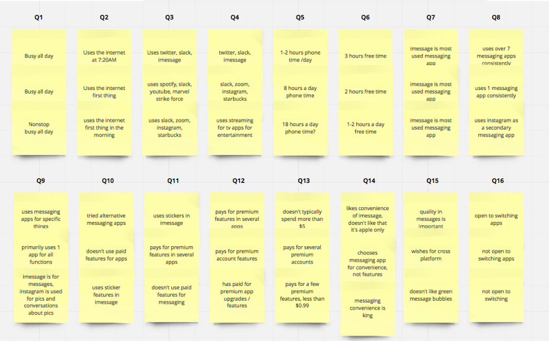
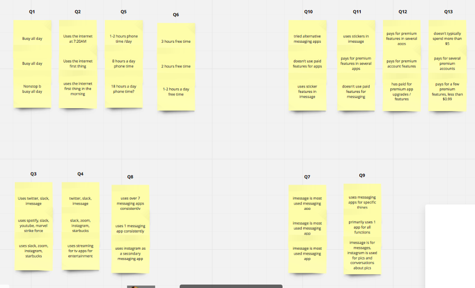
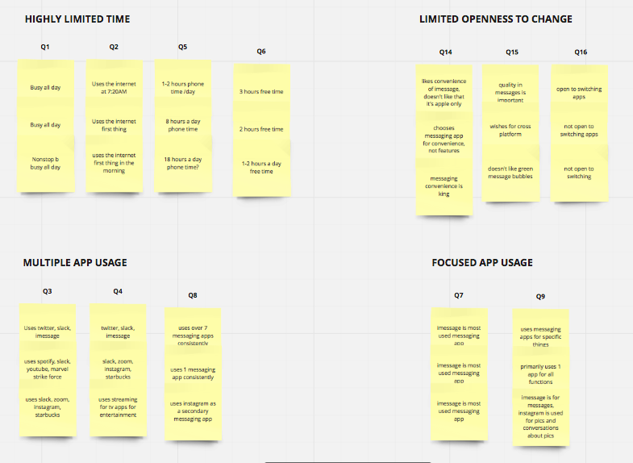

# Research Analysis

Table of Contents:  

a. [Additional Resources](#Additional-Resources)     
b. [Embracing Ambiguity](#Embracing-Ambiguity)     
c. [Design Synthesis](#Design-Synthesis)     
d. [Externalize Data](#Externalize-Data)     
e. [Write Down Your Top Five Ideas](#Write-Down-Your-Top-Five-Ideas)     
f. [Affinity Map](#Affinity-Map)     
g. [Insight Statements](#Insight-Statements)     
h. [How Might We](#How-Might-We)     
i. [Presenting User Research Results](#Presenting-User-Research-Results)       

 

## Additional Resources

#### Pre-Class Videos

[Research Analysis (11 min)](https://youtu.be/IaTaR-rkeWo)   

#### Assignment

[Research Analysis UX8 - Glenn Ference](https://www.youtube.com/watch?v=YE4pAqrYnmk&feature=youtu.be)  

[Research Analysis UXPT3 - Corey Nelson](https://youtu.be/sCAtSLYbEmQ)  

[Research Analysis Assignment](https://docs.google.com/document/d/1KYaI_Qt3C-N4Q7F4Wjgg8o14Y3OfX6CJDd6AZM2y6-k/edit)  

#### Other Cool Links

[Design Synthesis](http://www.designkit.org/methods/15) 

[Download Your Learnings](http://www.designkit.org/methods/12)  

[Finding Themes](http://www.designkit.org/methods/5)  

[Insight Statements](http://www.designkit.org/methods/62)  

[How Might We Statements](http://www.designkit.org/methods/3)  

[Example Discovery Research Report](https://docs.google.com/document/d/1_v-lf6P2m3qw-24RzWjlrmmDbv5ZvsVM2m2mErxnxeg/edit#)  

 

## Embracing Ambiguity

As UX designers, we interact with a lot of different data points during the research phase. It may seem easy to take our user research results and create an output, but in reality, we haven’t fully digested all of our data. By taking the time to sift through our research, we can come up with valuable insights.

To do so, we must get comfortable with the idea of ambiguity, especially when it comes to research analysis. By embracing ambiguity, we can give ourselves permission to be creative and pursue a variety of ideas. This mindset will allow us to get closer to innovative design solutions.

 

## Design Synthesis

After we’ve conducted our design research, it’s time to move into design synthesis.

Jon Kolko shares his definition of Design Synthesis: 

> “During synthesis, designers attempt to organize, manipulate, prune, and filter gathered data into a cohesive structure for information building.”

Another way of describing design synthesis is how we make sense of our data. Think of this as a way for us to turn chaotic data into order. It’s our ability to take all of this information, digest it, so that we can create meaningful experiences.

So how do we begin synthesizing all of our information? We do this by externalizing our data and creating an Affinity Map.

For another explanation of Design Synthesis, [read this](http://www.designkit.org/methods/15).

 

## Externalize Data

At this point, we’ve gathered a lot of notes. So how do we get a better picture of the problems that we’re trying to solve? How do we turn all of this ambiguous data into something actionable?

The first step is to get the information out of your laptop and place it on a giant wall so that the data can be visualized. 

We call this, `“Externalizing Data”` or as IDEO puts it, `“Downloading Your Learnings”`. 

This step is important so that we can later visually identify patterns and make connections. It also gives everyone a chance to see all of the data at the same time without being limited by our slides and spreadsheets.

It is highly recommended to conduct this exercise on the day of or the day after your research studies so that the information is fresh in your mind.

 

To begin, it’s helpful to get your tools set up. For example, if you’re working on-site with a team, you will need access to a big wall, big sheets of paper, sharpies and pads of Post-it notes.

At this point, you’re ready to start moving your data out of your laptop. Jon Kolko encourages a method called, “stop talking and draw”, where team members write their notes on Post-its.

Each post-it note should be representative of _one data point_. 

For example, these data points are your observations, memorable quotes from your stakeholder interviews, competitive research, click paths and more. As you’re writing these on a Post-it, it’s important to write big and legibly so that it’s easy to read.

 

After everyone has written their notes, it’s time to add them to the wall. Spend a few seconds talking about each Post-it by describing your impression of the experience.

When working with a group of team members, it’s important to stay organized. 

For example, if you’re working with a small sample size, each participant can represent a different colored Post-it. You may also find it helpful to map each Post-it to a specific resource by using a numbering system.

At the end of this exercise, it should feel like you’re in a giant war room full of Post-it notes and it should look similar to the photo we see on the right.

Learn more about Downloading Your Learnings [here](http://www.designkit.org/methods/12).

 

[Here](https://miro.com/welcomeonboard/41Hh2QO719piQnRhLqc0c0UazKenCoSwAtodpqir2qvPJuonVb9DYMXVBPX2UE4z) is an example layout of Externalized Data:

 

## Write Down Your Top Five Ideas

To prioritize all of the Post-its, gather your team and have everyone write down their Top Five Ideas that jump out to them. Share your Top Five. If something is unclear, ask questions. When you’re done, put your Top Five on a separate board to remind yourself of your priorities.

 

## Affinity Map

After we’ve externalized our data, it’s time to organize the Post-its to identify similar groupings. There are many different methods that we can apply in terms of synthesizing research data, but we’ll focus on a process called Affinity Mapping. As Kara Pernince puts it, `Affinity Mapping ` allows us to organize related facts into distinct clusters. 

IDEO also explains that this task is about finding themes.

After you’ve shared your learnings with the team, it’s time to make sense of them.

To begin, look for common patterns and relationships. Begin forming clusters of Post-its by moving them to a new board. The goal is to identify themes.

Jon Kolko explains that the process is less about finding the “right” relationships and more about finding “good relationships”. At times, you may find yourself duplicating Post-its that appear to fit in several different groupings. Continue to discuss and debate what’s emerging until everyone is satisfied.

After some time, you’ll begin to see clusters like the one above that should be identified by a theme.

Learn more about Finding Themes [here](http://www.designkit.org/methods/5).

[Here](https://miro.com/welcomeonboard/41Hh2QO719piQnRhLqc0c0UazKenCoSwAtodpqir2qvPJuonVb9DYMXVBPX2UE4z) is an example of turning externalized data into an affinity map:

 

## Insight Statements

After we’ve identified the key themes, it’s time to turn them into Insight Statements. An Insight Statement is a sentence or two that represents a perspective or possibility.

At the end of your exercise, you should be able to gather anywhere between three to eight insights. Having more than eight insights may suggest that there could be several repetitive ones.

Take the themes that you’ve identified and move them to a different board.

Rephrase one of the themes into a short sentence or two. Keep in mind that an insight is not a solution, it is simply a core insight into your research.

Once you’ve written down all of your Insight Statements, refer back to your Design Challenge and see if it relates. If not, discard it.

At the end of this exercise, you should have anywhere between three to eight insights that represent a new possibility.

Learn more about Insight Statements [here](http://www.designkit.org/methods/62).

 

## How Might We

After we’ve written out our insights, it’s time to turn these into opportunities by creating How Might We’s. How Might We’s allow us to reframe these insights and turn them into potential ideas.

Begin by looking at your insight statements and rephrase them by using, “How Might We’s”. The goal is to turn these insights into potential opportunities. The key is to not make these HMW’s too narrow, they should be detailed enough so that it will give you a chance to brainstorm and explore new ideas.

Learn more about formulating How Might We's [here](http://www.designkit.org/methods/3).

 

## Presenting User Research Results

There are a few guidelines that we can follow when it comes to reporting research results. The most effective way to review the data is to put together a presentation that prioritizes the findings that matter. By presenting every little detail that went into the user research, we run the risk of losing our stakeholder’s attention.

First, focus on your findings by displaying them visually by levels of severity. The severity of the problems can be displayed on a three-point scale indicating items that are critical, serious and minor. Usability.gov defines the following levels of severity as such:

> Critical: If we do not fix this, users will not be able to complete the scenario  
> Serious: Many users will be frustrated if we do not fix this; they may give up.  
> Minor: Users are annoyed, but this does not keep them from completing the scenario. This should be revisited later.  

 

You may also choose to supplement this grid by showcasing visuals. These visuals can include what parts tested well and what parts appeared challenging to participants.

[Here](https://docs.google.com/document/d/1_v-lf6P2m3qw-24RzWjlrmmDbv5ZvsVM2m2mErxnxeg/edit#) is an example Research Report.

 

### Storytelling to Inspire Empathy

Secondly, use storytelling to inspire empathy. Rather than jumping straight into the research results, it’s helpful to provide context for your stakeholders.

For example, what is the main challenge that we’re trying to solve? Talk about what your participants experienced. What did they love? What did they despise?

Towards the end of the presentation, suggest recommendations and next steps. Your recommendations should provide guidance, but not be too prescriptive. 

For example, we could make suggestions by using phrases like, “consider re-ordering the steps to make it more obvious to the user”, without explaining how it should be designed. 

By suggesting next steps, this will help the stakeholders prioritize what needs to be fixed. If pushing for a big change appears challenging, reframe the question and ask, “what is the smallest change that we’re able to make as a team?” may encourage stakeholders to move forward with a plan in place.

 

### Suggest Recommendations and Next Steps

Towards the end of the presentation, suggest recommendations and next steps. Your recommendations should provide guidance, but not be too prescriptive. For example, we could make suggestions by using phrases like, “consider re-ordering the steps to make it more obvious to the user”, without explaining how it should be designed. 

By suggesting next steps, this will help the stakeholders prioritize what needs to be fixed. If pushing for a big change appears challenging, reframe the question and ask, “what is the smallest change that we’re able to make as a team?” may encourage stakeholders to move forward with a plan in place.

 

